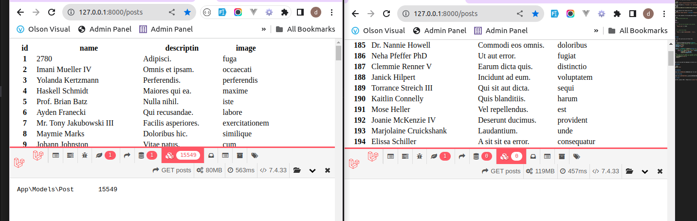

# Cache Watcher

Cache Watcher is a powerful Laravel package designed to turbocharge your application's performance by optimizing data management through caching. With Cache Watcher, you can seamlessly manage your data while enjoying automatic updates when changes occur.

---
## Result 


## Installation

You can install the package via composer if this command give error add
`:dev-main` at last as a version:

```bash
composer require mevada-kalpesh/cache-watcher
```
Add This Provider in `Providers` in `config/app.php` after installing the
package
```bash
 Kalpesh\CacheWatcher\CacheWatchServiceProvider::class
```

You can publish the config file with:
```bash
php artisan vendor:publish --provider="Kalpesh\CacheWatcher\CacheWatchServiceProvider"
```

This is the contents of the published config file:

```php
// config/cache-watcher.php

<?php

return [
    /*
    *   Time will be consider into minutes
    */
    'expire_time' => 1440,


    /*
    *   Cache Store Name  
    */
    'store' => env('CACHE_DRIVER', 'file'),
];

```

## Usage

for use this just you can follow this

```php

use Kalpesh\CacheWatcher\Facade\CacheWatch;
  // When any values change, the cache is automatically invalidated, and the latest data is fetched using the query.
  $search = "Johsn";
  $pagination = 10;
  $sortBy = "DESC"    

  $posts =  CacheWatch::setQuery(function () use ($search,$pagination,$sortBy){
    // You can use any complex query with Cache Watcher.
      return Post::where('name','like',"%$search%") 
            ->orderby('id',$sortBy)
            ->paginate($pagination);
  })
  //You can set your model as a watcher using `watchModals(YOUR MODALS ARRAY)` function, which means if any changes occur with this model, the cache will be automatically removed and updated with the new data.
  ->watchModals(['Post'])  
  ->done();
```


Make sure you add the namespace correctly as shown above.

## Testing

```bash
composer test
```

## Changelog

Please see [CHANGELOG](CHANGELOG.md) for more information on what has changed recently.

## Contributing

Please see [CONTRIBUTING](.github/CONTRIBUTING.md) for details.

## License

The MIT License (MIT). Please see [License File](LICENSE.md) for more information.